# Face Generation
We'll use generative adversarial networks to generate new images of faces.
### Get the Data
We'll be using two datasets in this project:
- MNIST
- CelebA

Since the celebA dataset is complex and you're doing GANs in a project for the first time, we want you to test your neural network on MNIST before CelebA.  Running the GANs on MNIST will allow you to see how well your model trains sooner.

If you're using [FloydHub](https://www.floydhub.com/), set `data_dir` to "/input" and use the [FloydHub data ID](http://docs.floydhub.com/home/using_datasets/) "R5KrjnANiKVhLWAkpXhNBe".

## Explore the Data
### MNIST
As you're aware, the [MNIST](http://yann.lecun.com/exdb/mnist/) dataset contains images of handwritten digits. You can view the first number of examples by changing `show_n_images`. 


```python
Image("download (2).png")
```


### CelebA
The [CelebFaces Attributes Dataset (CelebA)](http://mmlab.ie.cuhk.edu.hk/projects/CelebA.html) dataset contains over 200,000 celebrity images with annotations.  Since we're going to be generating faces, we won't need the annotations.  


```python
Image("download.png")
```


## Preprocess the Data
Since the project's main focus is on building the GANs, we'll preprocess the data for you.  The values of the MNIST and CelebA dataset will be in the range of -0.5 to 0.5 of 28x28 dimensional images.  The CelebA images will be cropped to remove parts of the image that don't include a face, then resized down to 28x28.

The MNIST images are black and white images with a single [color channel](https://en.wikipedia.org/wiki/Channel_(digital_image%29) while the CelebA images have [3 color channels (RGB color channel)](https://en.wikipedia.org/wiki/Channel_(digital_image%29#RGB_Images).
## Build the Neural Network
We'll build the components necessary to build a GANs by implementing the following functions below:
- `model_inputs`
- `discriminator`
- `generator`
- `model_loss`
- `model_opt`
- `train`

### Check the Version of TensorFlow and Access to GPU
This will check to make sure you have the correct version of TensorFlow and access to a GPU

### Input
Implement the `model_inputs` function to create TF Placeholders for the Neural Network. It should create the following placeholders:
- Real input images placeholder with rank 4 using `image_width`, `image_height`, and `image_channels`.
- Z input placeholder with rank 2 using `z_dim`.
- Learning rate placeholder with rank 0.

Return the placeholders in the following the tuple (tensor of real input images, tensor of z data)

### Discriminator
Implement `discriminator` to create a discriminator neural network that discriminates on `images`.  This function should be able to reuse the variabes in the neural network.  Use [`tf.variable_scope`](https://www.tensorflow.org/api_docs/python/tf/variable_scope) with a scope name of "discriminator" to allow the variables to be reused.  The function should return a tuple of (tensor output of the generator, tensor logits of the generator).

### Generator
Implement `generator` to generate an image using `z`. This function should be able to reuse the variabes in the neural network.  Use [`tf.variable_scope`](https://www.tensorflow.org/api_docs/python/tf/variable_scope) with a scope name of "generator" to allow the variables to be reused. The function should return the generated 28 x 28 x `out_channel_dim` images.

### Loss
Implement `model_loss` to build the GANs for training and calculate the loss.  The function should return a tuple of (discriminator loss, generator loss).  Use the following functions you implemented:
- `discriminator(images, reuse=False)`
- `generator(z, out_channel_dim, is_train=True)`

### Optimization
Implement `model_opt` to create the optimization operations for the GANs. Use [`tf.trainable_variables`](https://www.tensorflow.org/api_docs/python/tf/trainable_variables) to get all the trainable variables.  Filter the variables with names that are in the discriminator and generator scope names.  The function should return a tuple of (discriminator training operation, generator training operation).

## Neural Network Training


### Train
Implement `train` to build and train the GANs.  Use the following functions you implemented:
- `model_inputs(image_width, image_height, image_channels, z_dim)`
- `model_loss(input_real, input_z, out_channel_dim)`
- `model_opt(d_loss, g_loss, learning_rate, beta1)`

Use the `show_generator_output` to show `generator` output while you train. Running `show_generator_output` for every batch will drastically increase training time and increase the size of the notebook.  It's recommended to print the `generator` output every 100 batches.

### MNIST
Test your GANs architecture on MNIST.  After 2 epochs, the GANs should be able to generate images that look like handwritten digits.  Make sure the loss of the generator is lower than the loss of the discriminator or close to 0.


```python
batch_size = 128
z_dim = 128
learning_rate = 0.001
beta1 = 0.5


"""
DON'T MODIFY ANYTHING IN THIS CELL THAT IS BELOW THIS LINE
"""
epochs = 2

mnist_dataset = helper.Dataset('mnist', glob(os.path.join(data_dir, 'mnist/*.jpg')))
with tf.Graph().as_default():
    train(epochs, batch_size, z_dim, learning_rate, beta1, mnist_dataset.get_batches,
          mnist_dataset.shape, mnist_dataset.image_mode)
```

    Epoch 1/2... Batch 10... Discriminator Loss: 0.5023... Generator Loss: 10.1671
    Epoch 1/2... Batch 20... Discriminator Loss: 0.7331... Generator Loss: 2.8746
    Epoch 1/2... Batch 30... Discriminator Loss: 1.4220... Generator Loss: 0.5547
    Epoch 1/2... Batch 40... Discriminator Loss: 0.7115... Generator Loss: 2.0606
    Epoch 1/2... Batch 50... Discriminator Loss: 1.7921... Generator Loss: 1.1291
    Epoch 1/2... Batch 60... Discriminator Loss: 0.9696... Generator Loss: 1.6962
    Epoch 1/2... Batch 70... Discriminator Loss: 1.4085... Generator Loss: 3.3560
    Epoch 1/2... Batch 80... Discriminator Loss: 2.1041... Generator Loss: 0.2545
    Epoch 1/2... Batch 90... Discriminator Loss: 1.3636... Generator Loss: 0.7639
    Epoch 1/2... Batch 100... Discriminator Loss: 1.3319... Generator Loss: 0.8238
    


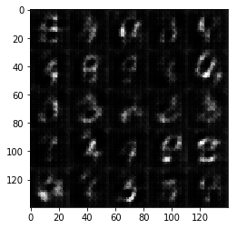


    Epoch 1/2... Batch 110... Discriminator Loss: 1.5062... Generator Loss: 1.8291
    Epoch 1/2... Batch 120... Discriminator Loss: 1.3286... Generator Loss: 2.2886
    Epoch 1/2... Batch 130... Discriminator Loss: 1.2690... Generator Loss: 1.7916
    Epoch 1/2... Batch 140... Discriminator Loss: 1.1989... Generator Loss: 1.0170
    Epoch 1/2... Batch 150... Discriminator Loss: 1.7810... Generator Loss: 0.3555
    Epoch 1/2... Batch 160... Discriminator Loss: 1.3277... Generator Loss: 1.9207
    Epoch 1/2... Batch 170... Discriminator Loss: 1.1771... Generator Loss: 1.0994
    Epoch 1/2... Batch 180... Discriminator Loss: 1.2264... Generator Loss: 0.9521
    Epoch 1/2... Batch 190... Discriminator Loss: 1.1879... Generator Loss: 0.9130
    Epoch 1/2... Batch 200... Discriminator Loss: 1.1921... Generator Loss: 0.9770
    


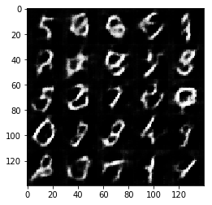


    Epoch 1/2... Batch 210... Discriminator Loss: 1.3045... Generator Loss: 1.5732
    Epoch 1/2... Batch 220... Discriminator Loss: 1.1723... Generator Loss: 1.2785
    Epoch 1/2... Batch 230... Discriminator Loss: 1.5844... Generator Loss: 0.4284
    Epoch 1/2... Batch 240... Discriminator Loss: 1.2048... Generator Loss: 0.8117
    Epoch 1/2... Batch 250... Discriminator Loss: 1.2200... Generator Loss: 1.1132
    Epoch 1/2... Batch 260... Discriminator Loss: 1.2036... Generator Loss: 1.0324
    Epoch 1/2... Batch 270... Discriminator Loss: 1.3243... Generator Loss: 0.6558
    Epoch 1/2... Batch 280... Discriminator Loss: 1.2193... Generator Loss: 1.0246
    Epoch 1/2... Batch 290... Discriminator Loss: 1.4078... Generator Loss: 0.5536
    Epoch 1/2... Batch 300... Discriminator Loss: 1.1370... Generator Loss: 0.8943
    


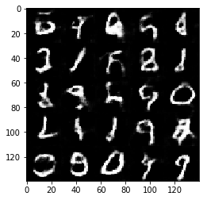


    Epoch 1/2... Batch 310... Discriminator Loss: 1.5961... Generator Loss: 0.4119
    Epoch 1/2... Batch 320... Discriminator Loss: 1.1567... Generator Loss: 1.0943
    Epoch 1/2... Batch 330... Discriminator Loss: 1.2707... Generator Loss: 1.2338
    Epoch 1/2... Batch 340... Discriminator Loss: 1.3841... Generator Loss: 0.5535
    Epoch 1/2... Batch 350... Discriminator Loss: 1.3581... Generator Loss: 1.5332
    Epoch 1/2... Batch 360... Discriminator Loss: 1.2775... Generator Loss: 1.0803
    Epoch 1/2... Batch 370... Discriminator Loss: 1.6444... Generator Loss: 0.3900
    Epoch 1/2... Batch 380... Discriminator Loss: 1.1722... Generator Loss: 1.2828
    Epoch 1/2... Batch 390... Discriminator Loss: 1.5357... Generator Loss: 0.4443
    Epoch 1/2... Batch 400... Discriminator Loss: 1.2018... Generator Loss: 0.7616
    


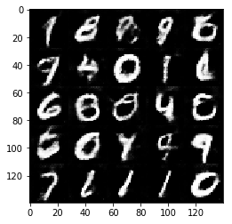


    Epoch 1/2... Batch 410... Discriminator Loss: 1.1899... Generator Loss: 0.9666
    Epoch 1/2... Batch 420... Discriminator Loss: 1.1645... Generator Loss: 1.0815
    Epoch 1/2... Batch 430... Discriminator Loss: 1.1591... Generator Loss: 0.8335
    Epoch 1/2... Batch 440... Discriminator Loss: 1.2725... Generator Loss: 1.3386
    Epoch 1/2... Batch 450... Discriminator Loss: 1.2971... Generator Loss: 0.6593
    Epoch 1/2... Batch 460... Discriminator Loss: 1.2719... Generator Loss: 0.6270
    Epoch 2/2... Batch 10... Discriminator Loss: 1.2456... Generator Loss: 0.9324
    Epoch 2/2... Batch 20... Discriminator Loss: 1.2295... Generator Loss: 0.7748
    Epoch 2/2... Batch 30... Discriminator Loss: 1.2060... Generator Loss: 0.8762
    Epoch 2/2... Batch 40... Discriminator Loss: 1.2028... Generator Loss: 1.1106
    Epoch 2/2... Batch 50... Discriminator Loss: 1.1809... Generator Loss: 0.8044
    Epoch 2/2... Batch 60... Discriminator Loss: 1.2829... Generator Loss: 1.3515
    Epoch 2/2... Batch 70... Discriminator Loss: 1.1259... Generator Loss: 1.0131
    Epoch 2/2... Batch 80... Discriminator Loss: 1.2074... Generator Loss: 0.8739
    Epoch 2/2... Batch 90... Discriminator Loss: 1.4683... Generator Loss: 0.5002
    Epoch 2/2... Batch 100... Discriminator Loss: 1.2924... Generator Loss: 0.6462
    


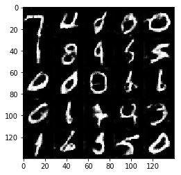


    Epoch 2/2... Batch 110... Discriminator Loss: 1.3258... Generator Loss: 1.2924
    Epoch 2/2... Batch 120... Discriminator Loss: 1.1654... Generator Loss: 0.9128
    Epoch 2/2... Batch 130... Discriminator Loss: 1.4688... Generator Loss: 0.5322
    Epoch 2/2... Batch 140... Discriminator Loss: 1.2305... Generator Loss: 0.8590
    Epoch 2/2... Batch 150... Discriminator Loss: 1.4073... Generator Loss: 0.5201
    Epoch 2/2... Batch 160... Discriminator Loss: 1.3877... Generator Loss: 1.6854
    Epoch 2/2... Batch 170... Discriminator Loss: 1.2994... Generator Loss: 0.6121
    Epoch 2/2... Batch 180... Discriminator Loss: 1.3761... Generator Loss: 0.5295
    Epoch 2/2... Batch 190... Discriminator Loss: 1.5615... Generator Loss: 0.4135
    Epoch 2/2... Batch 200... Discriminator Loss: 1.1619... Generator Loss: 0.8113
    


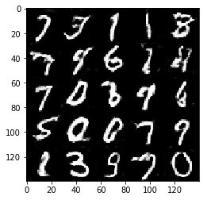


    Epoch 2/2... Batch 210... Discriminator Loss: 1.1363... Generator Loss: 1.0318
    Epoch 2/2... Batch 220... Discriminator Loss: 1.2543... Generator Loss: 1.6990
    Epoch 2/2... Batch 230... Discriminator Loss: 1.2923... Generator Loss: 0.7714
    Epoch 2/2... Batch 240... Discriminator Loss: 1.5269... Generator Loss: 1.8351
    Epoch 2/2... Batch 250... Discriminator Loss: 1.2152... Generator Loss: 1.1371
    Epoch 2/2... Batch 260... Discriminator Loss: 1.7497... Generator Loss: 2.1506
    Epoch 2/2... Batch 270... Discriminator Loss: 1.1943... Generator Loss: 0.8152
    Epoch 2/2... Batch 280... Discriminator Loss: 1.2333... Generator Loss: 1.2407
    Epoch 2/2... Batch 290... Discriminator Loss: 1.3056... Generator Loss: 1.1477
    Epoch 2/2... Batch 300... Discriminator Loss: 1.4746... Generator Loss: 0.4845
    


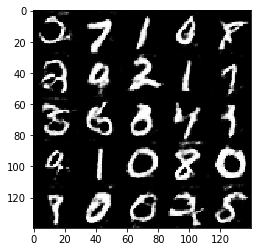


    Epoch 2/2... Batch 310... Discriminator Loss: 1.2023... Generator Loss: 1.1614
    Epoch 2/2... Batch 320... Discriminator Loss: 1.5587... Generator Loss: 0.4050
    Epoch 2/2... Batch 330... Discriminator Loss: 1.3034... Generator Loss: 0.6178
    Epoch 2/2... Batch 340... Discriminator Loss: 1.1116... Generator Loss: 0.9359
    Epoch 2/2... Batch 350... Discriminator Loss: 1.3498... Generator Loss: 1.5920
    Epoch 2/2... Batch 360... Discriminator Loss: 1.4162... Generator Loss: 0.5167
    Epoch 2/2... Batch 370... Discriminator Loss: 1.1702... Generator Loss: 1.2913
    Epoch 2/2... Batch 380... Discriminator Loss: 1.0914... Generator Loss: 1.0081
    Epoch 2/2... Batch 390... Discriminator Loss: 1.0676... Generator Loss: 1.1180
    Epoch 2/2... Batch 400... Discriminator Loss: 1.1455... Generator Loss: 0.8965
    


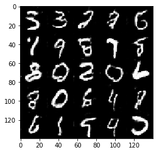


    Epoch 2/2... Batch 410... Discriminator Loss: 1.2998... Generator Loss: 1.6718
    Epoch 2/2... Batch 420... Discriminator Loss: 1.3026... Generator Loss: 0.6136
    Epoch 2/2... Batch 430... Discriminator Loss: 1.1128... Generator Loss: 1.1152
    Epoch 2/2... Batch 440... Discriminator Loss: 1.2098... Generator Loss: 1.2661
    Epoch 2/2... Batch 450... Discriminator Loss: 1.2246... Generator Loss: 1.6822
    Epoch 2/2... Batch 460... Discriminator Loss: 1.5625... Generator Loss: 0.4671
    

### CelebA
Run your GANs on CelebA.  It will take around 20 minutes on the average GPU to run one epoch.  You can run the whole epoch or stop when it starts to generate realistic faces.


```python
batch_size = 64
z_dim = 100
learning_rate = 0.0001
beta1 = 0.5


"""
DON'T MODIFY ANYTHING IN THIS CELL THAT IS BELOW THIS LINE
"""
epochs = 1

celeba_dataset = helper.Dataset('celeba', glob(os.path.join(data_dir, 'img_align_celeba/*.jpg')))
with tf.Graph().as_default():
    train(epochs, batch_size, z_dim, learning_rate, beta1, celeba_dataset.get_batches,
          celeba_dataset.shape, celeba_dataset.image_mode)
```

    Epoch 1/1... Batch 10... Discriminator Loss: 1.8236... Generator Loss: 0.4151
    Epoch 1/1... Batch 20... Discriminator Loss: 0.8843... Generator Loss: 1.1989
    Epoch 1/1... Batch 30... Discriminator Loss: 0.9429... Generator Loss: 1.1499
    Epoch 1/1... Batch 40... Discriminator Loss: 0.5765... Generator Loss: 2.1516
    Epoch 1/1... Batch 50... Discriminator Loss: 0.7011... Generator Loss: 1.5499
    Epoch 1/1... Batch 60... Discriminator Loss: 0.5164... Generator Loss: 4.0524
    Epoch 1/1... Batch 70... Discriminator Loss: 0.7842... Generator Loss: 1.6202
    Epoch 1/1... Batch 80... Discriminator Loss: 0.4507... Generator Loss: 2.8683
    Epoch 1/1... Batch 90... Discriminator Loss: 0.5184... Generator Loss: 2.4632
    Epoch 1/1... Batch 100... Discriminator Loss: 0.4922... Generator Loss: 2.3662
    


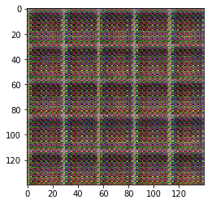


    Epoch 1/1... Batch 110... Discriminator Loss: 1.1330... Generator Loss: 5.3818
    Epoch 1/1... Batch 120... Discriminator Loss: 0.6224... Generator Loss: 2.1202
    Epoch 1/1... Batch 130... Discriminator Loss: 0.4660... Generator Loss: 2.9098
    Epoch 1/1... Batch 140... Discriminator Loss: 0.5721... Generator Loss: 1.8699
    Epoch 1/1... Batch 150... Discriminator Loss: 0.4608... Generator Loss: 2.8259
    Epoch 1/1... Batch 160... Discriminator Loss: 0.7344... Generator Loss: 1.2801
    Epoch 1/1... Batch 170... Discriminator Loss: 0.5873... Generator Loss: 2.4148
    Epoch 1/1... Batch 180... Discriminator Loss: 0.5162... Generator Loss: 2.6038
    Epoch 1/1... Batch 190... Discriminator Loss: 0.8539... Generator Loss: 1.4887
    Epoch 1/1... Batch 200... Discriminator Loss: 0.6922... Generator Loss: 1.5948
    


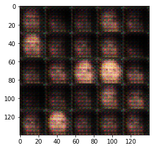


    Epoch 1/1... Batch 210... Discriminator Loss: 0.8914... Generator Loss: 1.3890
    Epoch 1/1... Batch 220... Discriminator Loss: 0.6816... Generator Loss: 1.7021
    Epoch 1/1... Batch 230... Discriminator Loss: 0.9156... Generator Loss: 1.9814
    Epoch 1/1... Batch 240... Discriminator Loss: 0.6860... Generator Loss: 1.8209
    Epoch 1/1... Batch 250... Discriminator Loss: 0.7485... Generator Loss: 2.5880
    Epoch 1/1... Batch 260... Discriminator Loss: 0.7131... Generator Loss: 1.9776
    Epoch 1/1... Batch 270... Discriminator Loss: 0.6336... Generator Loss: 2.0046
    Epoch 1/1... Batch 280... Discriminator Loss: 0.9490... Generator Loss: 3.0053
    Epoch 1/1... Batch 290... Discriminator Loss: 0.7352... Generator Loss: 1.4627
    Epoch 1/1... Batch 300... Discriminator Loss: 0.6917... Generator Loss: 1.8301
    


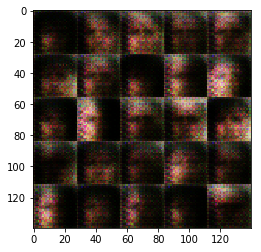


    Epoch 1/1... Batch 310... Discriminator Loss: 1.3062... Generator Loss: 0.5915
    Epoch 1/1... Batch 320... Discriminator Loss: 0.7876... Generator Loss: 2.1243
    Epoch 1/1... Batch 330... Discriminator Loss: 0.9186... Generator Loss: 1.2098
    Epoch 1/1... Batch 340... Discriminator Loss: 0.6813... Generator Loss: 1.9932
    Epoch 1/1... Batch 350... Discriminator Loss: 0.8240... Generator Loss: 1.7830
    Epoch 1/1... Batch 360... Discriminator Loss: 0.8137... Generator Loss: 1.4422
    Epoch 1/1... Batch 370... Discriminator Loss: 0.8586... Generator Loss: 1.2161
    Epoch 1/1... Batch 380... Discriminator Loss: 0.8126... Generator Loss: 1.4690
    Epoch 1/1... Batch 390... Discriminator Loss: 1.0099... Generator Loss: 1.9719
    Epoch 1/1... Batch 400... Discriminator Loss: 1.1254... Generator Loss: 1.5945
    


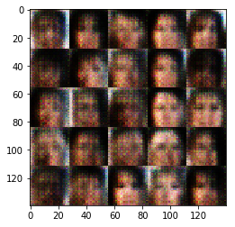


    Epoch 1/1... Batch 410... Discriminator Loss: 0.9919... Generator Loss: 1.2699
    Epoch 1/1... Batch 420... Discriminator Loss: 1.1094... Generator Loss: 2.3880
    Epoch 1/1... Batch 430... Discriminator Loss: 1.0226... Generator Loss: 1.0347
    Epoch 1/1... Batch 440... Discriminator Loss: 1.0432... Generator Loss: 1.7201
    Epoch 1/1... Batch 450... Discriminator Loss: 0.8027... Generator Loss: 2.2196
    Epoch 1/1... Batch 460... Discriminator Loss: 0.9369... Generator Loss: 2.3225
    Epoch 1/1... Batch 470... Discriminator Loss: 0.8285... Generator Loss: 1.9485
    Epoch 1/1... Batch 480... Discriminator Loss: 0.8544... Generator Loss: 1.4568
    Epoch 1/1... Batch 490... Discriminator Loss: 0.8625... Generator Loss: 1.4166
    Epoch 1/1... Batch 500... Discriminator Loss: 0.8875... Generator Loss: 1.3849
    


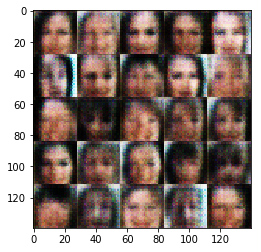


    Epoch 1/1... Batch 510... Discriminator Loss: 1.0365... Generator Loss: 0.9484
    Epoch 1/1... Batch 520... Discriminator Loss: 0.9659... Generator Loss: 1.1066
    Epoch 1/1... Batch 530... Discriminator Loss: 0.9442... Generator Loss: 1.1818
    Epoch 1/1... Batch 540... Discriminator Loss: 0.9235... Generator Loss: 1.2676
    Epoch 1/1... Batch 550... Discriminator Loss: 1.2688... Generator Loss: 0.6144
    Epoch 1/1... Batch 560... Discriminator Loss: 0.9778... Generator Loss: 1.3150
    Epoch 1/1... Batch 570... Discriminator Loss: 0.9567... Generator Loss: 1.4069
    Epoch 1/1... Batch 580... Discriminator Loss: 0.9454... Generator Loss: 1.2413
    Epoch 1/1... Batch 590... Discriminator Loss: 0.9886... Generator Loss: 1.3998
    Epoch 1/1... Batch 600... Discriminator Loss: 1.2866... Generator Loss: 0.8839
    


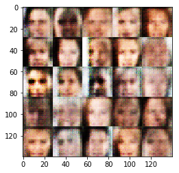


    Epoch 1/1... Batch 610... Discriminator Loss: 1.1730... Generator Loss: 1.5709
    Epoch 1/1... Batch 620... Discriminator Loss: 1.1417... Generator Loss: 0.8438
    Epoch 1/1... Batch 630... Discriminator Loss: 1.1508... Generator Loss: 1.2058
    Epoch 1/1... Batch 640... Discriminator Loss: 1.2297... Generator Loss: 0.7459
    Epoch 1/1... Batch 650... Discriminator Loss: 1.1362... Generator Loss: 1.0644
    Epoch 1/1... Batch 660... Discriminator Loss: 0.9790... Generator Loss: 1.4662
    Epoch 1/1... Batch 670... Discriminator Loss: 1.0667... Generator Loss: 0.9595
    Epoch 1/1... Batch 680... Discriminator Loss: 1.2148... Generator Loss: 1.4908
    Epoch 1/1... Batch 690... Discriminator Loss: 1.1831... Generator Loss: 0.7800
    Epoch 1/1... Batch 700... Discriminator Loss: 1.1624... Generator Loss: 1.0584
    


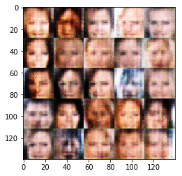


    Epoch 1/1... Batch 710... Discriminator Loss: 1.1535... Generator Loss: 1.3768
    Epoch 1/1... Batch 720... Discriminator Loss: 1.2399... Generator Loss: 0.6990
    Epoch 1/1... Batch 730... Discriminator Loss: 0.9826... Generator Loss: 1.2530
    Epoch 1/1... Batch 740... Discriminator Loss: 1.3965... Generator Loss: 1.8528
    Epoch 1/1... Batch 750... Discriminator Loss: 0.8994... Generator Loss: 1.2794
    Epoch 1/1... Batch 760... Discriminator Loss: 1.3019... Generator Loss: 0.7192
    Epoch 1/1... Batch 770... Discriminator Loss: 1.0077... Generator Loss: 1.1151
    Epoch 1/1... Batch 780... Discriminator Loss: 1.1487... Generator Loss: 0.9126
    Epoch 1/1... Batch 790... Discriminator Loss: 1.1114... Generator Loss: 1.0136
    Epoch 1/1... Batch 800... Discriminator Loss: 0.9605... Generator Loss: 1.3449
    


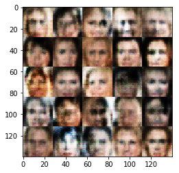


    Epoch 1/1... Batch 810... Discriminator Loss: 1.2511... Generator Loss: 0.6702
    Epoch 1/1... Batch 820... Discriminator Loss: 1.0960... Generator Loss: 1.0307
    Epoch 1/1... Batch 830... Discriminator Loss: 1.0533... Generator Loss: 1.1679
    Epoch 1/1... Batch 840... Discriminator Loss: 0.9293... Generator Loss: 1.5997
    Epoch 1/1... Batch 850... Discriminator Loss: 1.2585... Generator Loss: 1.9971
    Epoch 1/1... Batch 860... Discriminator Loss: 1.0533... Generator Loss: 1.0408
    Epoch 1/1... Batch 870... Discriminator Loss: 1.1478... Generator Loss: 0.8496
    Epoch 1/1... Batch 880... Discriminator Loss: 0.9898... Generator Loss: 1.0445
    Epoch 1/1... Batch 890... Discriminator Loss: 0.9620... Generator Loss: 1.0733
    Epoch 1/1... Batch 900... Discriminator Loss: 1.0888... Generator Loss: 1.1844
    


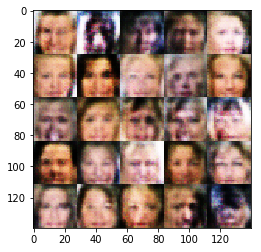


    Epoch 1/1... Batch 910... Discriminator Loss: 0.9967... Generator Loss: 1.5018
    Epoch 1/1... Batch 920... Discriminator Loss: 1.0503... Generator Loss: 1.2610
    Epoch 1/1... Batch 930... Discriminator Loss: 1.2574... Generator Loss: 0.6901
    Epoch 1/1... Batch 940... Discriminator Loss: 1.1126... Generator Loss: 1.2068
    Epoch 1/1... Batch 950... Discriminator Loss: 1.1067... Generator Loss: 0.8364
    Epoch 1/1... Batch 960... Discriminator Loss: 0.9593... Generator Loss: 1.2906
    Epoch 1/1... Batch 970... Discriminator Loss: 1.1549... Generator Loss: 0.8852
    Epoch 1/1... Batch 980... Discriminator Loss: 1.0898... Generator Loss: 1.1487
    Epoch 1/1... Batch 990... Discriminator Loss: 0.8725... Generator Loss: 1.5555
    Epoch 1/1... Batch 1000... Discriminator Loss: 1.2490... Generator Loss: 0.6078
    


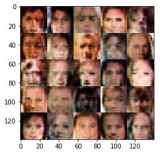


    Epoch 1/1... Batch 1010... Discriminator Loss: 1.2357... Generator Loss: 1.0864
    Epoch 1/1... Batch 1020... Discriminator Loss: 1.1200... Generator Loss: 1.0384
    Epoch 1/1... Batch 1030... Discriminator Loss: 1.0880... Generator Loss: 0.9210
    Epoch 1/1... Batch 1040... Discriminator Loss: 1.1972... Generator Loss: 0.7475
    Epoch 1/1... Batch 1050... Discriminator Loss: 1.1834... Generator Loss: 0.9295
    Epoch 1/1... Batch 1060... Discriminator Loss: 1.3004... Generator Loss: 0.6709
    Epoch 1/1... Batch 1070... Discriminator Loss: 1.1259... Generator Loss: 0.9022
    Epoch 1/1... Batch 1080... Discriminator Loss: 1.5175... Generator Loss: 0.4470
    Epoch 1/1... Batch 1090... Discriminator Loss: 1.0140... Generator Loss: 1.1199
    Epoch 1/1... Batch 1100... Discriminator Loss: 1.2778... Generator Loss: 0.7453
    


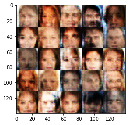


    Epoch 1/1... Batch 1110... Discriminator Loss: 0.9830... Generator Loss: 1.2853
    Epoch 1/1... Batch 1120... Discriminator Loss: 1.0858... Generator Loss: 0.8473
    Epoch 1/1... Batch 1130... Discriminator Loss: 0.9487... Generator Loss: 1.1323
    Epoch 1/1... Batch 1140... Discriminator Loss: 0.9809... Generator Loss: 1.0053
    Epoch 1/1... Batch 1150... Discriminator Loss: 1.1323... Generator Loss: 0.8671
    Epoch 1/1... Batch 1160... Discriminator Loss: 1.0091... Generator Loss: 1.0450
    Epoch 1/1... Batch 1170... Discriminator Loss: 1.5416... Generator Loss: 0.4452
    Epoch 1/1... Batch 1180... Discriminator Loss: 1.3798... Generator Loss: 0.5514
    Epoch 1/1... Batch 1190... Discriminator Loss: 1.0347... Generator Loss: 1.2749
    Epoch 1/1... Batch 1200... Discriminator Loss: 1.2267... Generator Loss: 0.9485
    


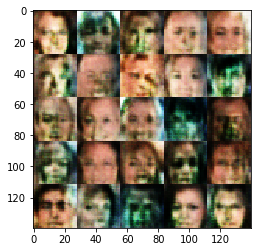


    Epoch 1/1... Batch 1210... Discriminator Loss: 1.0509... Generator Loss: 1.0538
    Epoch 1/1... Batch 1220... Discriminator Loss: 1.0773... Generator Loss: 1.1523
    Epoch 1/1... Batch 1230... Discriminator Loss: 1.1189... Generator Loss: 0.9319
    Epoch 1/1... Batch 1240... Discriminator Loss: 1.1188... Generator Loss: 1.2453
    Epoch 1/1... Batch 1250... Discriminator Loss: 1.1002... Generator Loss: 1.2368
    Epoch 1/1... Batch 1260... Discriminator Loss: 1.2165... Generator Loss: 0.7982
    Epoch 1/1... Batch 1270... Discriminator Loss: 0.8987... Generator Loss: 1.3679
    Epoch 1/1... Batch 1280... Discriminator Loss: 1.0369... Generator Loss: 1.0567
    Epoch 1/1... Batch 1290... Discriminator Loss: 1.1413... Generator Loss: 1.3607
    Epoch 1/1... Batch 1300... Discriminator Loss: 1.3107... Generator Loss: 0.6911
    


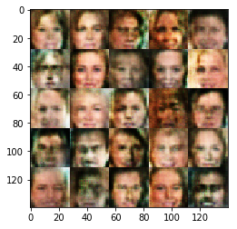


    Epoch 1/1... Batch 1310... Discriminator Loss: 1.1344... Generator Loss: 0.8684
    Epoch 1/1... Batch 1320... Discriminator Loss: 0.9574... Generator Loss: 1.3883
    Epoch 1/1... Batch 1330... Discriminator Loss: 1.0906... Generator Loss: 1.1974
    Epoch 1/1... Batch 1340... Discriminator Loss: 1.2101... Generator Loss: 0.8798
    Epoch 1/1... Batch 1350... Discriminator Loss: 1.1580... Generator Loss: 0.9512
    Epoch 1/1... Batch 1360... Discriminator Loss: 1.1314... Generator Loss: 0.8161
    Epoch 1/1... Batch 1370... Discriminator Loss: 1.0670... Generator Loss: 1.1263
    Epoch 1/1... Batch 1380... Discriminator Loss: 1.0108... Generator Loss: 1.2044
    Epoch 1/1... Batch 1390... Discriminator Loss: 1.1591... Generator Loss: 0.9195
    Epoch 1/1... Batch 1400... Discriminator Loss: 0.9682... Generator Loss: 1.0537
    


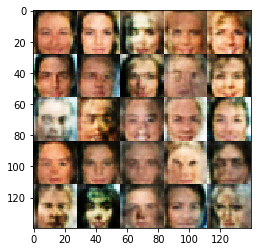


    Epoch 1/1... Batch 1410... Discriminator Loss: 1.1889... Generator Loss: 0.8402
    Epoch 1/1... Batch 1420... Discriminator Loss: 1.0190... Generator Loss: 1.0913
    Epoch 1/1... Batch 1430... Discriminator Loss: 1.1992... Generator Loss: 1.2365
    Epoch 1/1... Batch 1440... Discriminator Loss: 1.0256... Generator Loss: 1.2105
    Epoch 1/1... Batch 1450... Discriminator Loss: 1.1924... Generator Loss: 0.7207
    Epoch 1/1... Batch 1460... Discriminator Loss: 1.0838... Generator Loss: 1.0756
    Epoch 1/1... Batch 1470... Discriminator Loss: 1.2390... Generator Loss: 0.7845
    Epoch 1/1... Batch 1480... Discriminator Loss: 1.0655... Generator Loss: 1.1363
    Epoch 1/1... Batch 1490... Discriminator Loss: 0.9189... Generator Loss: 1.7885
    Epoch 1/1... Batch 1500... Discriminator Loss: 1.2903... Generator Loss: 0.6059
    


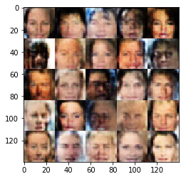


    Epoch 1/1... Batch 1510... Discriminator Loss: 1.1131... Generator Loss: 1.0217
    Epoch 1/1... Batch 1520... Discriminator Loss: 1.1617... Generator Loss: 0.8533
    Epoch 1/1... Batch 1530... Discriminator Loss: 1.1908... Generator Loss: 0.9112
    Epoch 1/1... Batch 1540... Discriminator Loss: 1.0493... Generator Loss: 1.0937
    Epoch 1/1... Batch 1550... Discriminator Loss: 1.4271... Generator Loss: 0.5318
    Epoch 1/1... Batch 1560... Discriminator Loss: 1.2189... Generator Loss: 0.7152
    Epoch 1/1... Batch 1570... Discriminator Loss: 0.9473... Generator Loss: 1.5927
    Epoch 1/1... Batch 1580... Discriminator Loss: 1.1378... Generator Loss: 1.1625
    Epoch 1/1... Batch 1590... Discriminator Loss: 0.9757... Generator Loss: 1.1408
    Epoch 1/1... Batch 1600... Discriminator Loss: 1.4252... Generator Loss: 0.6695
    


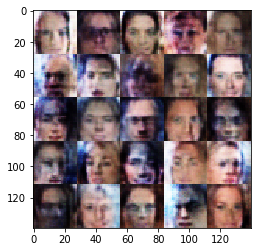


    Epoch 1/1... Batch 1610... Discriminator Loss: 1.2253... Generator Loss: 0.9132
    Epoch 1/1... Batch 1620... Discriminator Loss: 1.0670... Generator Loss: 0.9742
    Epoch 1/1... Batch 1630... Discriminator Loss: 1.1879... Generator Loss: 0.7359
    Epoch 1/1... Batch 1640... Discriminator Loss: 0.8743... Generator Loss: 1.5454
    Epoch 1/1... Batch 1650... Discriminator Loss: 1.2755... Generator Loss: 0.9938
    Epoch 1/1... Batch 1660... Discriminator Loss: 1.1568... Generator Loss: 0.7954
    Epoch 1/1... Batch 1670... Discriminator Loss: 1.1638... Generator Loss: 0.9968
    Epoch 1/1... Batch 1680... Discriminator Loss: 1.1343... Generator Loss: 1.4069
    Epoch 1/1... Batch 1690... Discriminator Loss: 1.2027... Generator Loss: 1.0717
    Epoch 1/1... Batch 1700... Discriminator Loss: 1.0915... Generator Loss: 1.0098
    


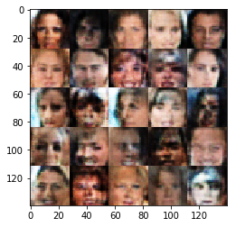


    Epoch 1/1... Batch 1710... Discriminator Loss: 1.1598... Generator Loss: 0.8583
    Epoch 1/1... Batch 1720... Discriminator Loss: 1.0200... Generator Loss: 1.0383
    Epoch 1/1... Batch 1730... Discriminator Loss: 1.2099... Generator Loss: 1.4879
    Epoch 1/1... Batch 1740... Discriminator Loss: 0.9514... Generator Loss: 1.4366
    Epoch 1/1... Batch 1750... Discriminator Loss: 1.1760... Generator Loss: 0.8586
    Epoch 1/1... Batch 1760... Discriminator Loss: 1.2419... Generator Loss: 0.7236
    Epoch 1/1... Batch 1770... Discriminator Loss: 1.1134... Generator Loss: 0.8034
    Epoch 1/1... Batch 1780... Discriminator Loss: 1.1969... Generator Loss: 0.8414
    Epoch 1/1... Batch 1790... Discriminator Loss: 1.2272... Generator Loss: 0.6970
    Epoch 1/1... Batch 1800... Discriminator Loss: 1.0459... Generator Loss: 1.1838
    


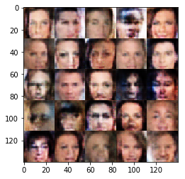


    Epoch 1/1... Batch 1810... Discriminator Loss: 1.1462... Generator Loss: 0.9775
    Epoch 1/1... Batch 1820... Discriminator Loss: 1.0414... Generator Loss: 1.0693
    Epoch 1/1... Batch 1830... Discriminator Loss: 1.0224... Generator Loss: 0.9871
    Epoch 1/1... Batch 1840... Discriminator Loss: 0.9672... Generator Loss: 1.2341
    Epoch 1/1... Batch 1850... Discriminator Loss: 1.1114... Generator Loss: 0.9439
    Epoch 1/1... Batch 1860... Discriminator Loss: 1.1783... Generator Loss: 0.8768
    Epoch 1/1... Batch 1870... Discriminator Loss: 1.1597... Generator Loss: 0.7979
    Epoch 1/1... Batch 1880... Discriminator Loss: 1.1327... Generator Loss: 0.8390
    Epoch 1/1... Batch 1890... Discriminator Loss: 1.1314... Generator Loss: 1.1089
    Epoch 1/1... Batch 1900... Discriminator Loss: 1.1302... Generator Loss: 1.0506
    


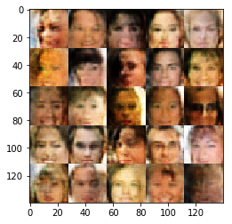


    Epoch 1/1... Batch 1910... Discriminator Loss: 1.1714... Generator Loss: 0.8920
    Epoch 1/1... Batch 1920... Discriminator Loss: 1.1475... Generator Loss: 1.0797
    Epoch 1/1... Batch 1930... Discriminator Loss: 1.1469... Generator Loss: 0.8405
    Epoch 1/1... Batch 1940... Discriminator Loss: 1.1230... Generator Loss: 0.8730
    Epoch 1/1... Batch 1950... Discriminator Loss: 1.1261... Generator Loss: 0.8464
    Epoch 1/1... Batch 1960... Discriminator Loss: 1.1412... Generator Loss: 0.8917
    Epoch 1/1... Batch 1970... Discriminator Loss: 1.1302... Generator Loss: 1.0814
    Epoch 1/1... Batch 1980... Discriminator Loss: 1.1923... Generator Loss: 0.7183
    Epoch 1/1... Batch 1990... Discriminator Loss: 1.0642... Generator Loss: 0.9975
    Epoch 1/1... Batch 2000... Discriminator Loss: 1.1585... Generator Loss: 0.8099
    


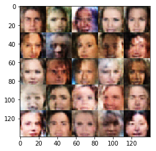


    Epoch 1/1... Batch 2010... Discriminator Loss: 1.0449... Generator Loss: 1.2263
    Epoch 1/1... Batch 2020... Discriminator Loss: 1.2332... Generator Loss: 0.7296
    Epoch 1/1... Batch 2030... Discriminator Loss: 1.0110... Generator Loss: 0.9876
    Epoch 1/1... Batch 2040... Discriminator Loss: 1.1568... Generator Loss: 0.9978
    Epoch 1/1... Batch 2050... Discriminator Loss: 1.3130... Generator Loss: 0.7722
    Epoch 1/1... Batch 2060... Discriminator Loss: 0.9549... Generator Loss: 1.2417
    Epoch 1/1... Batch 2070... Discriminator Loss: 1.1588... Generator Loss: 0.8536
    Epoch 1/1... Batch 2080... Discriminator Loss: 1.2132... Generator Loss: 0.7736
    Epoch 1/1... Batch 2090... Discriminator Loss: 1.0996... Generator Loss: 0.9697
    Epoch 1/1... Batch 2100... Discriminator Loss: 1.1945... Generator Loss: 0.7780
    


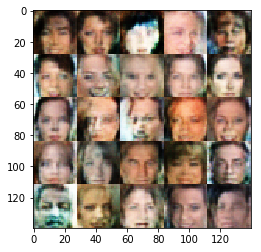


    Epoch 1/1... Batch 2110... Discriminator Loss: 1.1554... Generator Loss: 0.8280
    Epoch 1/1... Batch 2120... Discriminator Loss: 0.9864... Generator Loss: 1.0805
    Epoch 1/1... Batch 2130... Discriminator Loss: 1.1717... Generator Loss: 1.2229
    Epoch 1/1... Batch 2140... Discriminator Loss: 1.1217... Generator Loss: 1.0839
    Epoch 1/1... Batch 2150... Discriminator Loss: 1.0454... Generator Loss: 1.0188
    Epoch 1/1... Batch 2160... Discriminator Loss: 1.3139... Generator Loss: 0.5756
    Epoch 1/1... Batch 2170... Discriminator Loss: 1.0554... Generator Loss: 0.8033
    Epoch 1/1... Batch 2180... Discriminator Loss: 1.1851... Generator Loss: 0.9343
    Epoch 1/1... Batch 2190... Discriminator Loss: 1.2179... Generator Loss: 0.7460
    Epoch 1/1... Batch 2200... Discriminator Loss: 1.0930... Generator Loss: 0.9357
    


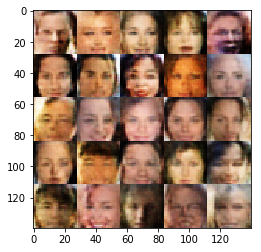


    Epoch 1/1... Batch 2210... Discriminator Loss: 1.3900... Generator Loss: 0.6138
    Epoch 1/1... Batch 2220... Discriminator Loss: 1.3137... Generator Loss: 0.8506
    Epoch 1/1... Batch 2230... Discriminator Loss: 1.2556... Generator Loss: 0.8079
    Epoch 1/1... Batch 2240... Discriminator Loss: 1.0333... Generator Loss: 1.0525
    Epoch 1/1... Batch 2250... Discriminator Loss: 1.1803... Generator Loss: 0.8121
    Epoch 1/1... Batch 2260... Discriminator Loss: 1.0608... Generator Loss: 0.9775
    Epoch 1/1... Batch 2270... Discriminator Loss: 1.2083... Generator Loss: 0.8763
    Epoch 1/1... Batch 2280... Discriminator Loss: 1.0548... Generator Loss: 1.0710
    Epoch 1/1... Batch 2290... Discriminator Loss: 1.2023... Generator Loss: 0.9424
    Epoch 1/1... Batch 2300... Discriminator Loss: 1.1151... Generator Loss: 0.9437
    


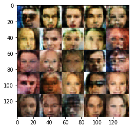


    Epoch 1/1... Batch 2310... Discriminator Loss: 1.0757... Generator Loss: 1.2173
    Epoch 1/1... Batch 2320... Discriminator Loss: 1.1852... Generator Loss: 0.9024
    Epoch 1/1... Batch 2330... Discriminator Loss: 1.1643... Generator Loss: 0.8845
    Epoch 1/1... Batch 2340... Discriminator Loss: 1.2294... Generator Loss: 0.7330
    Epoch 1/1... Batch 2350... Discriminator Loss: 1.0873... Generator Loss: 1.1320
    Epoch 1/1... Batch 2360... Discriminator Loss: 1.1944... Generator Loss: 0.8559
    Epoch 1/1... Batch 2370... Discriminator Loss: 0.9828... Generator Loss: 1.1771
    Epoch 1/1... Batch 2380... Discriminator Loss: 1.0552... Generator Loss: 0.9555
    Epoch 1/1... Batch 2390... Discriminator Loss: 1.0168... Generator Loss: 1.0560
    Epoch 1/1... Batch 2400... Discriminator Loss: 1.0271... Generator Loss: 1.2852
    


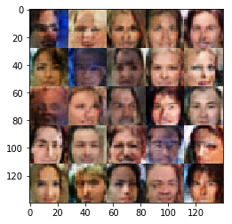


    Epoch 1/1... Batch 2410... Discriminator Loss: 1.0961... Generator Loss: 1.0823
    Epoch 1/1... Batch 2420... Discriminator Loss: 1.0483... Generator Loss: 1.1644
    Epoch 1/1... Batch 2430... Discriminator Loss: 1.2692... Generator Loss: 0.8990
    Epoch 1/1... Batch 2440... Discriminator Loss: 1.3304... Generator Loss: 0.7208
    Epoch 1/1... Batch 2450... Discriminator Loss: 1.1954... Generator Loss: 0.7381
    Epoch 1/1... Batch 2460... Discriminator Loss: 1.1099... Generator Loss: 1.0189
    Epoch 1/1... Batch 2470... Discriminator Loss: 1.6051... Generator Loss: 0.5764
    Epoch 1/1... Batch 2480... Discriminator Loss: 1.1435... Generator Loss: 1.0733
    Epoch 1/1... Batch 2490... Discriminator Loss: 1.3224... Generator Loss: 1.1445
    Epoch 1/1... Batch 2500... Discriminator Loss: 1.0753... Generator Loss: 1.0353
    


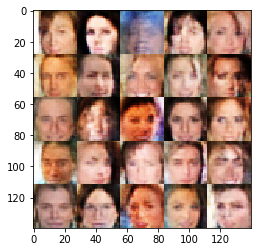


    Epoch 1/1... Batch 2510... Discriminator Loss: 1.1953... Generator Loss: 0.7777
    Epoch 1/1... Batch 2520... Discriminator Loss: 1.2968... Generator Loss: 0.7919
    Epoch 1/1... Batch 2530... Discriminator Loss: 1.2868... Generator Loss: 0.8835
    Epoch 1/1... Batch 2540... Discriminator Loss: 1.2056... Generator Loss: 0.7766
    Epoch 1/1... Batch 2550... Discriminator Loss: 1.2582... Generator Loss: 0.8474
    Epoch 1/1... Batch 2560... Discriminator Loss: 1.2029... Generator Loss: 0.7646
    Epoch 1/1... Batch 2570... Discriminator Loss: 1.2497... Generator Loss: 0.6563
    Epoch 1/1... Batch 2580... Discriminator Loss: 1.4584... Generator Loss: 0.7884
    Epoch 1/1... Batch 2590... Discriminator Loss: 1.1706... Generator Loss: 0.7710
    Epoch 1/1... Batch 2600... Discriminator Loss: 0.9507... Generator Loss: 1.0831
    


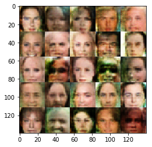


    Epoch 1/1... Batch 2610... Discriminator Loss: 1.0444... Generator Loss: 1.0293
    Epoch 1/1... Batch 2620... Discriminator Loss: 1.2558... Generator Loss: 0.7579
    Epoch 1/1... Batch 2630... Discriminator Loss: 1.4064... Generator Loss: 0.5288
    Epoch 1/1... Batch 2640... Discriminator Loss: 1.1474... Generator Loss: 1.0365
    Epoch 1/1... Batch 2650... Discriminator Loss: 1.1618... Generator Loss: 1.2616
    Epoch 1/1... Batch 2660... Discriminator Loss: 1.1443... Generator Loss: 0.8174
    Epoch 1/1... Batch 2670... Discriminator Loss: 1.1983... Generator Loss: 0.9303
    Epoch 1/1... Batch 2680... Discriminator Loss: 1.2531... Generator Loss: 0.6246
    Epoch 1/1... Batch 2690... Discriminator Loss: 1.1254... Generator Loss: 0.9238
    Epoch 1/1... Batch 2700... Discriminator Loss: 1.3196... Generator Loss: 0.7747
    


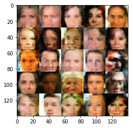


    Epoch 1/1... Batch 2710... Discriminator Loss: 1.1559... Generator Loss: 0.8121
    Epoch 1/1... Batch 2720... Discriminator Loss: 1.3149... Generator Loss: 0.5736
    Epoch 1/1... Batch 2730... Discriminator Loss: 0.9301... Generator Loss: 1.2636
    Epoch 1/1... Batch 2740... Discriminator Loss: 1.2197... Generator Loss: 0.6862
    Epoch 1/1... Batch 2750... Discriminator Loss: 1.3032... Generator Loss: 0.7418
    Epoch 1/1... Batch 2760... Discriminator Loss: 1.1930... Generator Loss: 0.7115
    Epoch 1/1... Batch 2770... Discriminator Loss: 1.5239... Generator Loss: 0.4786
    Epoch 1/1... Batch 2780... Discriminator Loss: 1.2893... Generator Loss: 0.6336
    Epoch 1/1... Batch 2790... Discriminator Loss: 1.1611... Generator Loss: 0.8522
    Epoch 1/1... Batch 2800... Discriminator Loss: 1.1912... Generator Loss: 0.7390
    


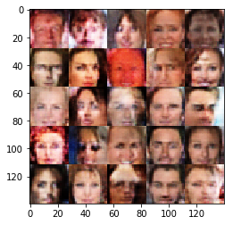


    Epoch 1/1... Batch 2810... Discriminator Loss: 1.0284... Generator Loss: 0.9153
    Epoch 1/1... Batch 2820... Discriminator Loss: 0.9129... Generator Loss: 1.1997
    Epoch 1/1... Batch 2830... Discriminator Loss: 1.1398... Generator Loss: 1.4644
    Epoch 1/1... Batch 2840... Discriminator Loss: 1.2252... Generator Loss: 0.8400
    Epoch 1/1... Batch 2850... Discriminator Loss: 1.3043... Generator Loss: 0.6667
    Epoch 1/1... Batch 2860... Discriminator Loss: 1.0580... Generator Loss: 1.0361
    Epoch 1/1... Batch 2870... Discriminator Loss: 1.1653... Generator Loss: 0.8745
    Epoch 1/1... Batch 2880... Discriminator Loss: 1.3336... Generator Loss: 0.7354
    Epoch 1/1... Batch 2890... Discriminator Loss: 1.1351... Generator Loss: 0.9243
    Epoch 1/1... Batch 2900... Discriminator Loss: 1.1001... Generator Loss: 1.1922
    


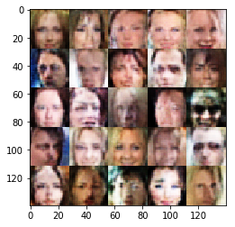


    Epoch 1/1... Batch 2910... Discriminator Loss: 1.1030... Generator Loss: 0.8488
    Epoch 1/1... Batch 2920... Discriminator Loss: 1.0176... Generator Loss: 0.9328
    Epoch 1/1... Batch 2930... Discriminator Loss: 1.2446... Generator Loss: 0.7509
    Epoch 1/1... Batch 2940... Discriminator Loss: 1.1834... Generator Loss: 0.8722
    Epoch 1/1... Batch 2950... Discriminator Loss: 1.2094... Generator Loss: 0.8072
    Epoch 1/1... Batch 2960... Discriminator Loss: 1.1583... Generator Loss: 0.9290
    Epoch 1/1... Batch 2970... Discriminator Loss: 1.0741... Generator Loss: 1.2530
    Epoch 1/1... Batch 2980... Discriminator Loss: 1.1823... Generator Loss: 1.3273
    Epoch 1/1... Batch 2990... Discriminator Loss: 1.1311... Generator Loss: 0.7834
    Epoch 1/1... Batch 3000... Discriminator Loss: 1.0570... Generator Loss: 0.9991
    


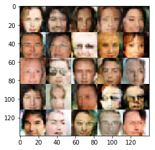


    Epoch 1/1... Batch 3010... Discriminator Loss: 1.1497... Generator Loss: 0.7354
    Epoch 1/1... Batch 3020... Discriminator Loss: 1.1475... Generator Loss: 0.7525
    Epoch 1/1... Batch 3030... Discriminator Loss: 1.0130... Generator Loss: 0.9984
    Epoch 1/1... Batch 3040... Discriminator Loss: 0.9031... Generator Loss: 1.3053
    Epoch 1/1... Batch 3050... Discriminator Loss: 1.2745... Generator Loss: 0.7592
    Epoch 1/1... Batch 3060... Discriminator Loss: 1.1733... Generator Loss: 0.9156
    Epoch 1/1... Batch 3070... Discriminator Loss: 1.2175... Generator Loss: 0.6805
    Epoch 1/1... Batch 3080... Discriminator Loss: 1.1298... Generator Loss: 0.8400
    Epoch 1/1... Batch 3090... Discriminator Loss: 1.1089... Generator Loss: 1.0312
    Epoch 1/1... Batch 3100... Discriminator Loss: 1.2108... Generator Loss: 0.8414
    


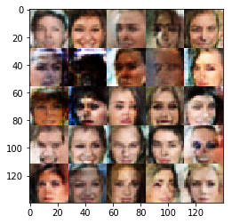


    Epoch 1/1... Batch 3110... Discriminator Loss: 1.4065... Generator Loss: 0.5253
    Epoch 1/1... Batch 3120... Discriminator Loss: 1.0924... Generator Loss: 1.1520
    Epoch 1/1... Batch 3130... Discriminator Loss: 1.2870... Generator Loss: 0.7654
    Epoch 1/1... Batch 3140... Discriminator Loss: 1.2060... Generator Loss: 0.9286
    Epoch 1/1... Batch 3150... Discriminator Loss: 1.1768... Generator Loss: 0.9597
    Epoch 1/1... Batch 3160... Discriminator Loss: 1.2231... Generator Loss: 0.7065
    


```python
Image("Untitled.png")
```


