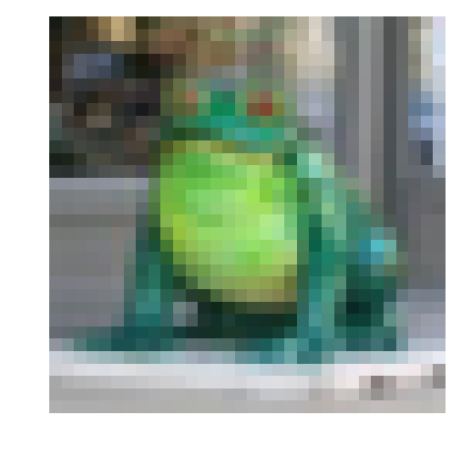
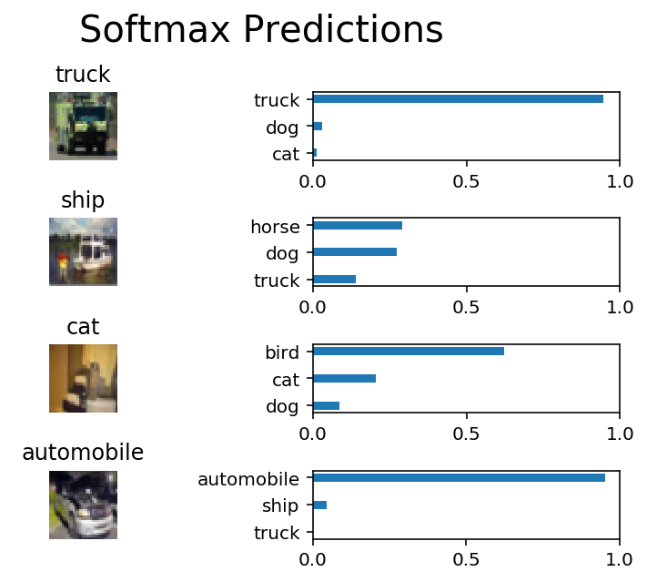

# Image Classification
In this project, we'll classify images from the [CIFAR-10 dataset](https://www.cs.toronto.edu/~kriz/cifar.html).  The dataset consists of airplanes, dogs, cats, and other objects. You'll preprocess the images, then train a convolutional neural network on all the samples. The images need to be normalized and the labels need to be one-hot encoded.  We'll get to build a convolutional, max pooling, dropout, and fully connected layers. 
## Get the Data
Run the following cell to download the [CIFAR-10 dataset for python](https://www.cs.toronto.edu/~kriz/cifar-10-python.tar.gz).

## Explore the Data
The dataset is broken into batches to prevent your machine from running out of memory.  The CIFAR-10 dataset consists of 5 batches, named `data_batch_1`, `data_batch_2`, etc.. Each batch contains the labels and images that are one of the following:
* airplane
* automobile
* bird
* cat
* deer
* dog
* frog
* horse
* ship
* truck

Understanding a dataset is part of making predictions on the data.  Play around with the code cell below by changing the `batch_id` and `sample_id`. The `batch_id` is the id for a batch (1-5). The `sample_id` is the id for a image and label pair in the batch.

Ask yourself "What are all possible labels?", "What is the range of values for the image data?", "Are the labels in order or random?".  Answers to questions like these will help you preprocess the data and end up with better predictions.


```python
%matplotlib inline
%config InlineBackend.figure_format = 'retina'

import helper
import numpy as np

# Explore the dataset
batch_id = 1
sample_id = 19
helper.display_stats(cifar10_dataset_folder_path, batch_id, sample_id)
```

    
    Stats of batch 1:
    Samples: 10000
    Label Counts: {0: 1005, 1: 974, 2: 1032, 3: 1016, 4: 999, 5: 937, 6: 1030, 7: 1001, 8: 1025, 9: 981}
    First 20 Labels: [6, 9, 9, 4, 1, 1, 2, 7, 8, 3, 4, 7, 7, 2, 9, 9, 9, 3, 2, 6]
    
    Example of Image 19:
    Image - Min Value: 9 Max Value: 242
    Image - Shape: (32, 32, 3)
    Label - Label Id: 6 Name: frog
    





## Implement Preprocess Functions
### Normalize
In the cell below, implement the `normalize` function to take in image data, `x`, and return it as a normalized Numpy array. The values should be in the range of 0 to 1, inclusive.  

### One-hot encode
We'll implementing a function for preprocessing.  This time, we'll implement the `one_hot_encode` function. The input, `x`, are a list of labels.  Implement the function to return the list of labels as One-Hot encoded Numpy array.  The possible values for labels are 0 to 9. The one-hot encoding function should return the same encoding for each value between each call to `one_hot_encode`. 

## Build the network
For the neural network, we'll build each layer into a function.  Most of the code you've seen has been outside of functions.

>**Note:** If you're finding it hard to dedicate enough time for this course each week, we've provided a small shortcut to this part of the project. In the next couple of problems, you'll have the option to use classes from the [TensorFlow Layers](https://www.tensorflow.org/api_docs/python/tf/layers) or [TensorFlow Layers (contrib)](https://www.tensorflow.org/api_guides/python/contrib.layers) packages to build each layer, except the layers you build in the "Convolutional and Max Pooling Layer" section.  TF Layers is similar to Keras's and TFLearn's abstraction to layers, so it's easy to pickup.

>However, if you would like to get the most out of this course, try to solve all the problems _without_ using anything from the TF Layers packages. You **can** still use classes from other packages that happen to have the same name as ones you find in TF Layers! For example, instead of using the TF Layers version of the `conv2d` class, [tf.layers.conv2d](https://www.tensorflow.org/api_docs/python/tf/layers/conv2d), you would want to use the TF Neural Network version of `conv2d`, [tf.nn.conv2d](https://www.tensorflow.org/api_docs/python/tf/nn/conv2d). 

Let's begin!

### Input
The neural network needs to read the image data, one-hot encoded labels, and dropout keep probability. Implement the following functions
* Implement `neural_net_image_input`
 * Return a [TF Placeholder](https://www.tensorflow.org/api_docs/python/tf/placeholder)
 * Set the shape using `image_shape` with batch size set to `None`.
 * Name the TensorFlow placeholder "x" using the TensorFlow `name` parameter in the [TF Placeholder](https://www.tensorflow.org/api_docs/python/tf/placeholder).
* Implement `neural_net_label_input`
 * Return a [TF Placeholder](https://www.tensorflow.org/api_docs/python/tf/placeholder)
 * Set the shape using `n_classes` with batch size set to `None`.
 * Name the TensorFlow placeholder "y" using the TensorFlow `name` parameter in the [TF Placeholder](https://www.tensorflow.org/api_docs/python/tf/placeholder).
* Implement `neural_net_keep_prob_input`
 * Return a [TF Placeholder](https://www.tensorflow.org/api_docs/python/tf/placeholder) for dropout keep probability.
 * Name the TensorFlow placeholder "keep_prob" using the TensorFlow `name` parameter in the [TF Placeholder](https://www.tensorflow.org/api_docs/python/tf/placeholder).


### Convolution and Max Pooling Layer
Convolution layers have a lot of success with images. For this code cell, we should implement the function `conv2d_maxpool` to apply convolution then max pooling:
* Create the weight and bias using `conv_ksize`, `conv_num_outputs` and the shape of `x_tensor`.
* Apply a convolution to `x_tensor` using weight and `conv_strides`.
* Add bias
* Add a nonlinear activation to the convolution.
* Apply Max Pooling using `pool_ksize` and `pool_strides`.


### Flatten Layer
Implement the `flatten` function to change the dimension of `x_tensor` from a 4-D tensor to a 2-D tensor.  The output should be the shape (*Batch Size*, *Flattened Image Size*). 

### Fully-Connected Layer
Implement the `fully_conn` function to apply a fully connected layer to `x_tensor` with the shape (*Batch Size*, *num_outputs*). 

### Output Layer
Implement the `output` function to apply a fully connected layer to `x_tensor` with the shape (*Batch Size*, *num_outputs*). 

### Create Convolutional Model
Implement the function `conv_net` to create a convolutional neural network model. The function takes in a batch of images, `x`, and outputs logits. 

* Apply 1, 2, or 3 Convolution and Max Pool layers
* Apply a Flatten Layer
* Apply 1, 2, or 3 Fully Connected Layers
* Apply an Output Layer
* Return the output
* Apply [TensorFlow's Dropout](https://www.tensorflow.org/api_docs/python/tf/nn/dropout) to one or more layers in the model using `keep_prob`. 

## Train the Neural Network
### Single Optimization
Implement the function `train_neural_network` to do a single optimization.  The optimization should use `optimizer` to optimize in `session` with a `feed_dict` of the following:
* `x` for image input
* `y` for labels
* `keep_prob` for keep probability for dropout


### Show Stats
Implement the function `print_stats` to print loss and validation accuracy.  Use the global variables `valid_features` and `valid_labels` to calculate validation accuracy.  Use a keep probability of `1.0` to calculate the loss and validation accuracy.

### Hyperparameters
Tune the following parameters:
* Set `epochs` to the number of iterations until the network stops learning or start overfitting
* Set `batch_size` to the highest number that your machine has memory for.  Most people set them to common sizes of memory:
 * 64
 * 128
 * 256
 * ...
* Set `keep_probability` to the probability of keeping a node using dropout

### Train on a Single CIFAR-10 Batch
Instead of training the neural network on all the CIFAR-10 batches of data, let's use a single batch. This should save time while you iterate on the model to get a better accuracy.  Once the final validation accuracy is 50% or greater, run the model on all the data in the next section.


```python
"""
DON'T MODIFY ANYTHING IN THIS CELL
"""
print('Checking the Training on a Single Batch...')
with tf.Session() as sess:
    # Initializing the variables
    sess.run(tf.global_variables_initializer())
    
    # Training cycle
    for epoch in range(epochs):
        batch_i = 1
        for batch_features, batch_labels in helper.load_preprocess_training_batch(batch_i, batch_size):
            train_neural_network(sess, optimizer, keep_probability, batch_features, batch_labels)
        print('Epoch {:>2}, CIFAR-10 Batch {}:  '.format(epoch + 1, batch_i), end='')
        print_stats(sess, batch_features, batch_labels, cost, accuracy)
```

    Checking the Training on a Single Batch...
    Epoch  1, CIFAR-10 Batch 1:  Loss:     2.1105. Validation Accuracy: 0.187500
    Epoch  2, CIFAR-10 Batch 1:  Loss:     2.1328. Validation Accuracy: 0.191406
    Epoch  3, CIFAR-10 Batch 1:  Loss:     2.1394. Validation Accuracy: 0.185547
    Epoch  4, CIFAR-10 Batch 1:  Loss:     2.0567. Validation Accuracy: 0.193359
    Epoch  5, CIFAR-10 Batch 1:  Loss:     2.0094. Validation Accuracy: 0.226562
    Epoch  6, CIFAR-10 Batch 1:  Loss:     1.9486. Validation Accuracy: 0.279297
    Epoch  7, CIFAR-10 Batch 1:  Loss:     1.8101. Validation Accuracy: 0.308594
    Epoch  8, CIFAR-10 Batch 1:  Loss:     1.6464. Validation Accuracy: 0.343750
    Epoch  9, CIFAR-10 Batch 1:  Loss:     1.5236. Validation Accuracy: 0.373047
    Epoch 10, CIFAR-10 Batch 1:  Loss:     1.4196. Validation Accuracy: 0.402344
    Epoch 11, CIFAR-10 Batch 1:  Loss:     1.4941. Validation Accuracy: 0.410156
    Epoch 12, CIFAR-10 Batch 1:  Loss:     1.2730. Validation Accuracy: 0.451172
    Epoch 13, CIFAR-10 Batch 1:  Loss:     1.2049. Validation Accuracy: 0.457031
    Epoch 14, CIFAR-10 Batch 1:  Loss:     1.1689. Validation Accuracy: 0.470703
    Epoch 15, CIFAR-10 Batch 1:  Loss:     0.9597. Validation Accuracy: 0.490234
    Epoch 16, CIFAR-10 Batch 1:  Loss:     0.9195. Validation Accuracy: 0.472656
    Epoch 17, CIFAR-10 Batch 1:  Loss:     0.9277. Validation Accuracy: 0.474609
    Epoch 18, CIFAR-10 Batch 1:  Loss:     0.8547. Validation Accuracy: 0.503906
    Epoch 19, CIFAR-10 Batch 1:  Loss:     0.7588. Validation Accuracy: 0.500000
    Epoch 20, CIFAR-10 Batch 1:  Loss:     0.8072. Validation Accuracy: 0.492188
    Epoch 21, CIFAR-10 Batch 1:  Loss:     0.6380. Validation Accuracy: 0.478516
    Epoch 22, CIFAR-10 Batch 1:  Loss:     0.6826. Validation Accuracy: 0.480469
    Epoch 23, CIFAR-10 Batch 1:  Loss:     0.6613. Validation Accuracy: 0.486328
    Epoch 24, CIFAR-10 Batch 1:  Loss:     0.6815. Validation Accuracy: 0.484375
    Epoch 25, CIFAR-10 Batch 1:  Loss:     0.7097. Validation Accuracy: 0.460938
    Epoch 26, CIFAR-10 Batch 1:  Loss:     0.6066. Validation Accuracy: 0.445312
    Epoch 27, CIFAR-10 Batch 1:  Loss:     0.5066. Validation Accuracy: 0.429688
    Epoch 28, CIFAR-10 Batch 1:  Loss:     0.5144. Validation Accuracy: 0.464844
    Epoch 29, CIFAR-10 Batch 1:  Loss:     0.4863. Validation Accuracy: 0.490234
    Epoch 30, CIFAR-10 Batch 1:  Loss:     0.4835. Validation Accuracy: 0.486328
    

### Fully Train the Model
Now that you got a good accuracy with a single CIFAR-10 batch, try it with all five batches.


## Test Model
Test your model against the test dataset.


```python
Image("download (1).png")
```





```python

```
